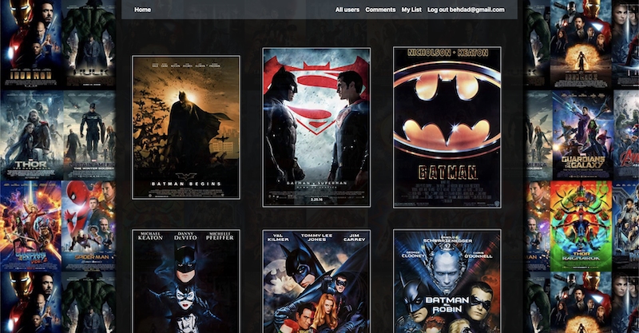

# IMDB Project

## Link of the Website.
Here is a link to the IMDB Project: [IMDB Project](https://behdadimdb.herokuapp.com/).

## Functionalities
Here you can see some functionalities that I used in this project:

- CSS
- MVC
- Html
- JQuery
- Heroku
- Bootstrap
- JavaScript
- Ruby on rails
- Github version controling

## How this Website is working.
> The Website has different modes, if you are a guest you have least accebility to the website. You can search movies and see the details of the movie also other users comments.

> As a normal user, you have all off the guest accebility, also you can add a movie to your favorite list and add comment. 

> Admin has all of the above featuers, also it can remove users and their comments.

## Contact information.
This Website is made by Behdad Setoodegan. You can contact me through email.
behdadsetoodeagn@gmail.com

